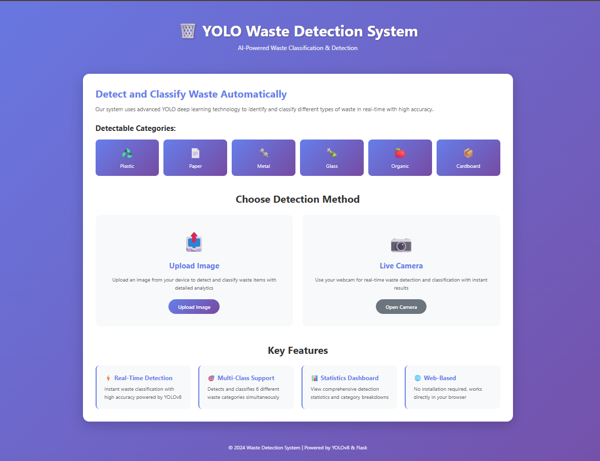
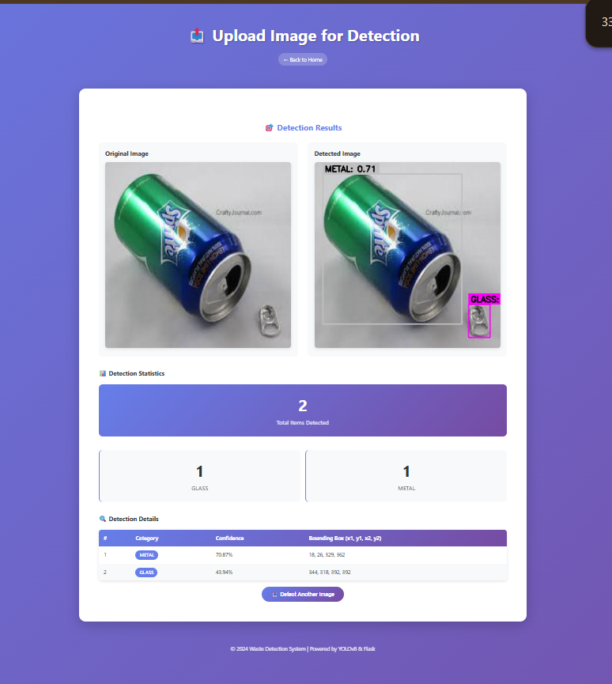
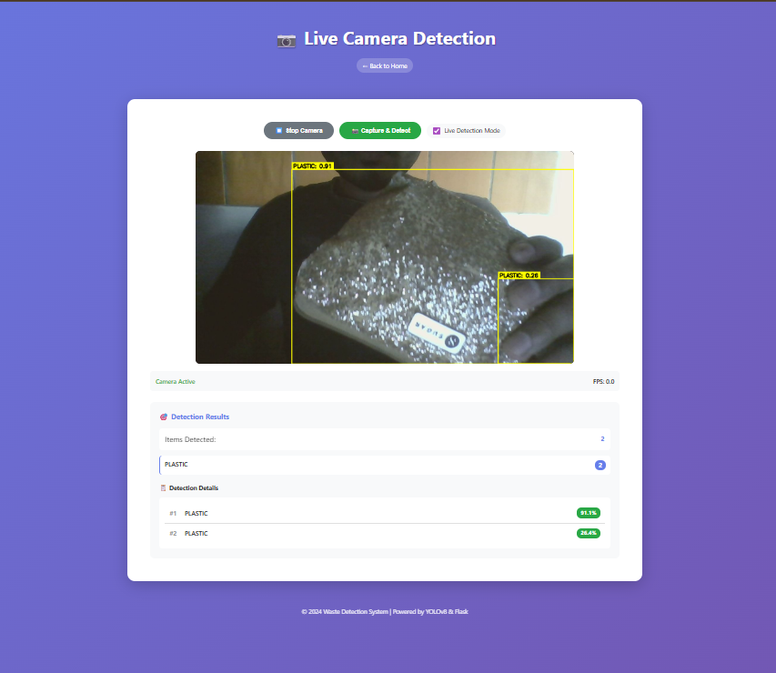

# 🗑️ YOLO-Based Waste Detection System

A complete web application for real-time waste detection and classification using YOLOv8 deep learning model.


## ✨ Features

- 📤 **Image Upload Detection** - Upload images for instant waste classification
- 📷 **Live Camera Detection** - Real-time detection using webcam
- 🎯 **Multi-Class Classification** - Detects 6 waste categories (Plastic, Paper, Metal, Glass, Organic, Cardboard)
- 📊 **Statistics Dashboard** - View detection counts and category breakdowns
- 🎨 **Modern UI** - Responsive, professional web interface
- ⚡ **High Performance** - Powered by YOLOv8 for accurate, fast detection


## 🖼️ Screenshots


*Simple and intuitive interface*


*Instant AI-powered predictions*


*Instant AI-powered predictions*

## 📋 Table of Contents

- [Installation](#-installation)
- [Quick Start](#-quick-start)
- [Project Structure](#-project-structure)
- [Training](#-training-your-own-model)
- [Usage](#-usage)
- [API Documentation](#-api-documentation)
- [Configuration](#-configuration)
- [Troubleshooting](#-troubleshooting)

## 🚀 Installation

### Prerequisites

- Python 3.8 or higher
- Webcam (for live detection feature)
- CUDA-capable GPU (optional, for faster training)

### Step 1: Clone the Repository

```bash
git clone <your-repo-url>
cd WasteDetection
```

### Step 2: Create Virtual Environment

```bash
# Create virtual environment
python -m venv venv

# Activate virtual environment
# On Windows:
venv\Scripts\activate
# On macOS/Linux:
source venv/bin/activate
```

### Step 3: Install Dependencies

```bash
pip install --upgrade pip
pip install -r requirements.txt
```

### Step 4: Get a Trained Model

**Option A: Use Pre-trained Model** (Quick Start)
- Place your trained `best.pt` model in the `models/` folder

**Option B: Train Your Own Model** (See [Training](#-training-your-own-model) section)

## ⚡ Quick Start

```bash
# 1. Activate virtual environment
source venv/bin/activate  # or venv\Scripts\activate on Windows

# 2. Ensure model is in place
ls models/best.pt

# 3. Run the application
python app.py

# 4. Open browser and go to:
http://localhost:5000
```

That's it! 🎉

## 📁 Project Structure

```
WasteDetection/
│
├── app.py                      # Flask application (main file)
├── train.py                    # Training script
├── requirements.txt            # Python dependencies
├── data.yaml                   # Dataset configuration
├── .gitignore                  # Git ignore rules
│
├── models/                     # Trained models
│   └── best.pt                # Best model weights (you need to add this)
│
├── utils/                      # Utility modules
│   ├── __init__.py
│   └── detector.py            # YOLO detection wrapper
│
├── templates/                  # HTML templates
│   ├── index.html             # Homepage
│   ├── upload.html            # Upload interface
│   └── camera.html            # Camera interface
│
├── static/                     # Static files
│   ├── css/
│   │   └── style.css          # Stylesheet
│   ├── js/
│   └── uploads/               # Uploaded images (auto-created)
│
└── dataset/                    # Training dataset
    ├── train/
    │   ├── images/
    │   └── labels/
    ├── valid/
    │   ├── images/
    │   └── labels/
    └── test/
        ├── images/
        └── labels/
```

## 🎓 Training Your Own Model

### 1. Prepare Dataset

Organize your dataset in YOLO format:

```
dataset/
├── train/
│   ├── images/     # Training images (.jpg, .png)
│   └── labels/     # YOLO format labels (.txt)
├── valid/
│   ├── images/
│   └── labels/
└── test/
    ├── images/
    └── labels/
```

**Label Format** (each `.txt` file):
```
class_id x_center y_center width height
```
All values are normalized (0-1).

### 2. Configure Dataset

Edit `data.yaml`:

```yaml
train: ./dataset/train/images
val: ./dataset/valid/images
test: ./dataset/test/images

nc: 6  # Number of classes

names:
  0: plastic
  1: paper
  2: metal
  3: glass
  4: organic
  5: cardboard
```

### 3. Train Model

```bash
python train.py
```

**Training Parameters** (editable in `train.py`):
- `epochs`: Number of training epochs (default: 100)
- `batch`: Batch size (default: 16)
- `imgsz`: Image size (default: 640)
- Model size: yolov8n/s/m/l/x

### 4. Use Trained Model

After training completes:

```bash
# Copy best model to models folder
cp runs/detect/waste_detection/weights/best.pt models/best.pt

# Run the app
python app.py
```

## 🖥️ Usage

### 1. Upload Mode

1. Navigate to **Upload Image** from homepage
2. Drag and drop or select an image
3. Click **Detect Waste**
4. View results:
   - Side-by-side comparison (original vs detected)
   - Detection statistics
   - Detailed detection table

### 2. Camera Mode

1. Navigate to **Live Camera** from homepage
2. Click **Start Camera** and grant permissions
3. Choose detection mode:
   - **Capture & Detect**: Single frame detection
   - **Live Detection Mode**: Continuous real-time detection
4. View live statistics and detections

## 📡 API Documentation

### POST `/detect`

Upload and detect waste in an image.

**Request:**
```http
POST /detect
Content-Type: multipart/form-data

file: <image_file>
confidence: 0.25 (optional)
```

**Response:**
```json
{
  "success": true,
  "original_image": "/static/uploads/image.jpg",
  "detected_image": "/static/uploads/detected_image.jpg",
  "detections": [
    {
      "class": "plastic",
      "confidence": 0.95,
      "bbox": [100, 150, 200, 250]
    }
  ],
  "statistics": {
    "total_items": 3,
    "categories": {
      "plastic": 2,
      "paper": 1
    }
  }
}
```

### POST `/detect_frame`

Detect waste in a camera frame.

**Request:**
```json
{
  "image": "data:image/jpeg;base64,...",
  "confidence": 0.25
}
```

**Response:** Same format as `/detect`

### GET `/health`

Health check endpoint.

**Response:**
```json
{
  "status": "healthy",
  "model_loaded": true
}
```

## ⚙️ Configuration

### Model Settings (utils/detector.py)

```python
# Confidence threshold
conf_threshold = 0.25  # 0.0 to 1.0

# Colors for each category
self.colors = {
    'plastic': (0, 255, 255),
    'paper': (255, 255, 255),
    # ... customize as needed
}
```

### Flask Settings (app.py)

```python
# Upload settings
app.config['MAX_CONTENT_LENGTH'] = 16 * 1024 * 1024  # 16MB
ALLOWED_EXTENSIONS = {'png', 'jpg', 'jpeg', 'bmp', 'webp'}

# Server settings
host = '0.0.0.0'
port = 5000
debug = True
```

## 🐛 Troubleshooting

### Model Not Found

```
Error: Model not found at models/best.pt
```

**Solution:**
```bash
# Train a model or download pre-trained weights
python train.py
# Then copy to models/
cp runs/detect/waste_detection/weights/best.pt models/best.pt
```

### Camera Not Working

```
Error accessing camera
```

**Solutions:**
- Grant browser camera permissions
- Close other apps using the camera
- Try a different browser (Chrome recommended)
- For production, use HTTPS (browsers require secure context)

### Out of Memory (Training)

```
CUDA out of memory
```

**Solutions:**
```python
# In train.py, reduce batch size
batch=8  # instead of 16

# Or use smaller model
model = YOLO('yolov8n.pt')  # instead of yolov8x.pt
```

### Module Not Found

```
ModuleNotFoundError: No module named 'ultralytics'
```

**Solution:**
```bash
# Make sure virtual environment is activated
source venv/bin/activate  # or venv\Scripts\activate

# Reinstall dependencies
pip install -r requirements.txt
```

## 📊 Performance

### Model Comparison

| Model | Speed | Accuracy | Use Case |
|-------|-------|----------|----------|
| YOLOv8n | ⚡⚡⚡ | ⭐⭐⭐ | Real-time, CPU |
| YOLOv8s | ⚡⚡ | ⭐⭐⭐⭐ | Balanced |
| YOLOv8m | ⚡ | ⭐⭐⭐⭐ | High accuracy |
| YOLOv8l/x | 🐌 | ⭐⭐⭐⭐⭐ | Best accuracy, GPU only |

## 📝 License

This project is licensed under the MIT License.

## 🙏 Acknowledgments

- [Ultralytics YOLOv8](https://github.com/ultralytics/ultralytics)
- [Flask](https://flask.palletsprojects.com/)
- [OpenCV](https://opencv.org/)

## 📧 Contact

For questions or issues, please open an issue on GitHub.

---

**Made with ❤️ for a cleaner planet 🌍♻️**
